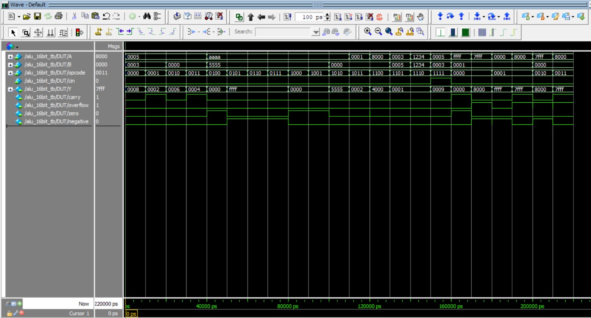
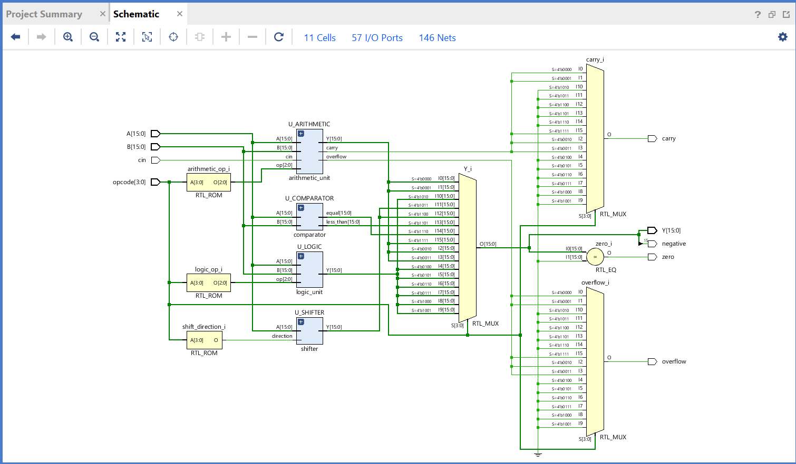
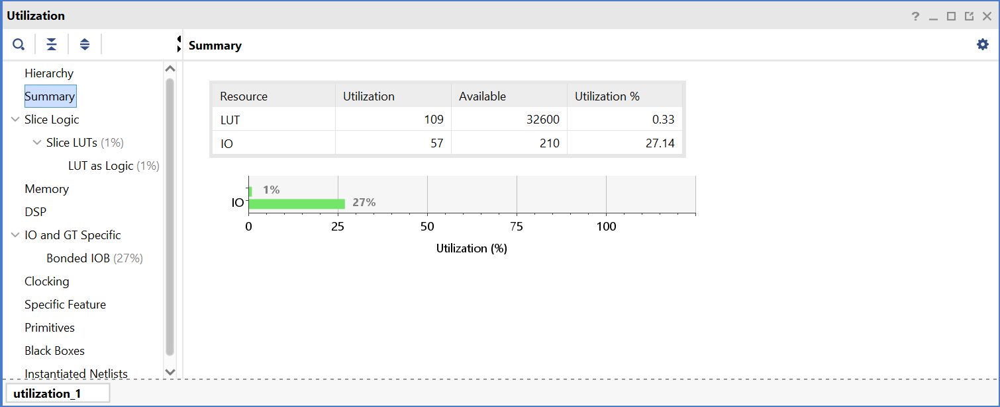

# 16-bit ALU

A 16-bit structural ALU designed in Verilog using a hierarchical RTL architecture.

## Features

- 16-bit operands
- 16 ALU operations
- Structural/hierarchical design
- 16-bit ripple-carry adder using full adders
- Arithmetic, logic, shift and comparison operations
- Carry and signed overflow detection
- Zero and negative status flags
- Self-checking Verilog testbench
- Verified using ModelSim
- Synthesized using Xilinx Vivado

## Operations

| Opcode | Operation | Description |
|--------|-----------|-------------|
| 0000 | ADD | A + B |
| 0001 | SUB | A - B |
| 0010 | INC | A + 1 |
| 0011 | DEC | A - 1 |
| 0100 | AND | A & B |
| 0101 | OR | A \| B |
| 0110 | XOR | A ^ B |
| 0111 | NAND | ~(A & B) |
| 1000 | NOR | ~(A \| B) |
| 1001 | XNOR | ~(A ^ B) |
| 1010 | NOT | ~A |
| 1011 | SLL | A << 1 |
| 1100 | SRL | A >> 1 |
| 1101 | SLT | A < B |
| 1110 | EQ | A == B |
| 1111 | ADC | A + B + cin |

## Arithmetic Design

A shared 16-bit ripple-carry adder is used for all arithmetic operations.

- ADD: `A + B`
- SUB: `A + ~B + 1`
- INC: `A + 1`
- DEC: `A + FFFF`
- ADC: `A + B + cin`

Subtraction uses two's complement arithmetic.

## Status Flags

- `carry` — carry output from arithmetic operations
- `overflow` — signed arithmetic overflow
- `zero` — asserted when `Y = 0`
- `negative` — equal to `Y[15]`

For subtraction:

- `carry = 1` → no borrow
- `carry = 0` → borrow

## Verification

The ALU was verified using a self-checking Verilog testbench.

```text
PASS = 22
FAIL = 0
TOTAL = 22

ALL TESTS PASSED!
```
The testbench includes:
- All 16 ALU operations
- Addition carry case
- Addition signed overflow
- Subtraction borrow case
- Subtraction signed overflow
- Increment overflow
- Decrement overflow

## Simulation



## Synthesis



### Resource Utilization



## Tools

- Verilog HDL
- ModelSim
- Xilinx Vivado
